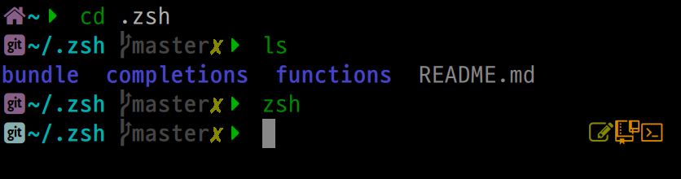

# FLAzSH - fastest ZSH you've ever seen

My settings for ZSH with custom theme.

It includes [oh-my-zsh](https://github.com/ohmyzsh/ohmyzsh) (but loads it
only partially), may also include
[prezto](https://github.com/sorin-ionescu/prezto) etc. - so it's possible
to use themes/plugins from any of them.

## Install

Remove `~/.zsh/`, then:

```
git clone https://github.com/powerman/flazsh ~/.zsh
```

## Theme

My theme uses wide icons from [Nerd Fonts](https://www.nerdfonts.com/),
which means you'll probably need to install both some of these fonts and
also [wcwidth-icons](https://github.com/powerman/wcwidth-icons) hack.

Tested only in urxvt.


